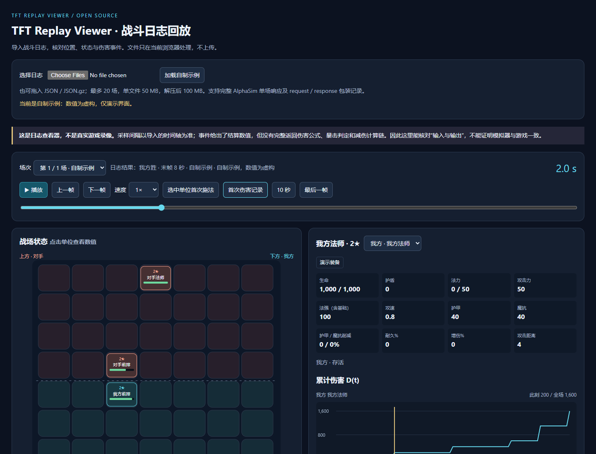

# TFT Replay Viewer

在浏览器里回放、检查 TFT 战斗日志：伤害何时发生，单位如何移动，以及事件前后生命、护盾、法力发生了什么变化。

**[在线体验](https://mqw7373.github.io/tft-replay-viewer/)** · [日志格式](docs/FORMAT.md) · [第三方来源](THIRD_PARTY_NOTICES.md)



这是独立的日志查看工具，不包含战斗模拟引擎。默认示例是本项目自制的虚构数据，不代表任何真实英雄或阵容强度。

## 使用

1. 打开在线页面，或下载仓库后直接双击 `index.html`。不需要安装 Node.js。
2. 点击“选择日志”，或者把 `.json` / `.json.gz` 拖入页面。支持一次导入最多 20 个单场日志文件。
3. 切换场次、播放或拖动时间轴。点击单位查看属性与累计伤害，点击事件查看原始字段和相邻采样状态。
4. 可下载当前原始日志；只有原文件带 `request` 时，才能导出开战请求。

文件仅在当前浏览器解析，不上传；刷新页面后清除。应用没有统计脚本、外部字体、图片 CDN 或 API 请求。访问在线站点本身仍会连接 GitHub Pages。

使用支持 `DecompressionStream` 的现代浏览器导入 gzip；不支持时可先自行解压为 JSON。单文件最大 50 MB，解压后最大 100 MB。

## 支持范围

- 兼容已验证形状的 AlphaSim 完整单场响应，也支持包含 `request` 和 `response.data` 的保存记录。
- 单位位置、HP / 护盾 / 法力 / 属性、累计伤害曲线、施法 / 伤害 / 负值回复 / 死亡事件。
- 解析时检查时间轴、快照长度、单位索引和必要字段；失败时保留之前的回放。
- 名称优先使用日志自带 `displayName` / `name`，缺失时显示 API ID。本项目不打包第三方英雄和装备数据库。
- 没有 `request` 时不会根据开战后的移动快照猜测原始棋格。

## 如何理解回放

- 这是采样数据展示，不是游戏录像。不同日志的采样间隔可能不同。
- `CumDmg` 是来源日志定义的累计伤害，不一定等于有效生命损失。
- 同一采样区间可能有多次攻击、回复和护盾变化。不能把采样前后生命差归因于一条事件。
- `evDmg`、负值事件的目标归属、部分内部公式尚未核实，页面不补造解释。
- 持续伤害的触发、弹道命中、暴击和减伤是否正确，需要引擎调试记录或实际游戏对照验证。
- 已识别的石甲虫死亡召唤以母体死亡时刻推定出生；其他新增召唤物出生时间未知时不显示棋盘位置，并提示原因。它们仍可在单位下拉框中查看原始快照。
- 批量胜率摘要、游戏客户端录像文件和缺少逐帧状态的日志不受支持。

## 开发与测试

运行应用没有构建步骤、没有运行时依赖。Node.js 22+ 只用于开发检查：

```sh
node --test tests/adapter.test.cjs
npm ci
npx playwright install chromium
npm run test:browser
```

已安装 Edge 时也可用 `BROWSER_CHANNEL=msedge` 运行浏览器测试（PowerShell：`$env:BROWSER_CHANNEL='msedge'`）。

`examples/demo.json` 是示例源文件；修改后运行 `npm run sync-demo` 更新直接打开网页所需的 `examples/demo.js`。测试会检查两者一致。

```text
index.html             页面与控件
src/viewer.js          棋盘、播放、曲线与导入交互
src/alphasim.js        已知日志格式校验及转换
src/style.css         样式
examples/             自制示例
tests/                解析与浏览器交互检查
```

## 发布 GitHub Pages

仓库 Settings → Pages → Source 选择 **GitHub Actions**。推送 `main` 后，工作流执行解析测试和浏览器测试，再部署静态页面。Fork 后请更新 README 顶部的在线地址。

## 贡献

欢迎提交复现步骤、截图或小型自制日志。请勿在 Issue / PR 中上传未获许可的第三方完整数据库、账号令牌或个人信息。新增日志字段的解释需要附来源或复核方法；未知语义应明确保留为未知。

项目在 AI 辅助下开发。MIT 许可证适用于本仓库自有代码、文档与自制示例；不替第三方日志或游戏素材授予许可。详见 [THIRD_PARTY_NOTICES.md](THIRD_PARTY_NOTICES.md)。

## English

A static, local-first viewer for TFT combat logs. Open `index.html` and import a supported AlphaSim JSON / gzip log. Inspect sampled positions, stats, cumulative damage and raw events. No server, login, game assets or simulation engine is bundled. The included fixture is synthetic. Unknown engine semantics remain explicitly unknown; this is not proof of in-game accuracy.
